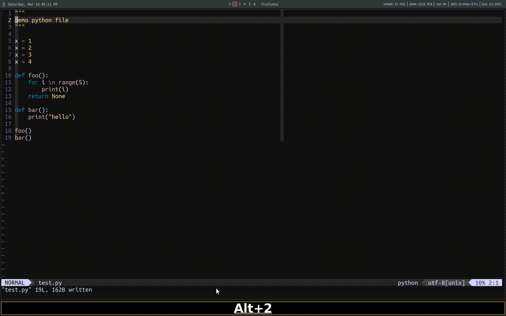

## iron.vim


## How to install
To install, you may doing the following
```bash
mkdir -p ~/.vim/pack/nickeisenberg/start
cd ~/.vim/pack/nickeisenberg/start
git clone https://github.com/nickeisenberg/iron.vim.git
```

If you prefer to use a package manager, such as vim plug, you may do the
following instead
```vimscript
  Plug 'nickeisenberg/iron.vim'
```

## How to configure
Iron allows you to define custom repl definitions. These are commands that
are sent to the terminal, which open up the repl. For example, 

```vimscript
let g:iron_repl_def = {
 \ "python": "ipython --no--autoindent",
 \ "sh": "zsh --login"
\ }
```

By default, the filetype will be used as the repl definition.

Iron provides a function, `iron#view#split`, that allows you to define split
that opens the repl. The first command is the split command, ie `rightbelow`,
`botright`, `vert botright`, etc. The second command is the percent of the size
of the current buffer to be used at the size of the split.

```vimscript
let g:iron_repl_open_cmd = {
  \ 'vertical': iron#view#split('vertical rightbelow', 0.4),
  \ 'horizontal': iron#view#split('rightbelow', 0.25),
  \ '<name>': iron#view#split('<split_cmd>', <size>),
\}
```
Moreover, each `iron_repl_open_cmd` will be accessible in `iron_keymaps` with
the name `toggle_<repl_open_cmd_name>` along the other following preset
named keymaps.

```vimscript
let g:iron_keymaps = {
  \ "toggle_repl": "<leader>rr",
  \ "toggle_vertical": "<leader>rv",
  \ "toggle_horizontal": "<leader>rh",
  \ "toggle_<name>": "<leader>r1",
  \ "repl_restart": "<leader>rR",
  \ "repl_kill": "<leader>rk",
  \ "send_line": "<leader>sl",
  \ "send_visual": "<leader>sp",
  \ "send_paragraph": "<leader>sp",
  \ "send_until_cursor": "<leader>su",
  \ "send_file": "<leader>sf",
  \ "send_cancel": "<leader>sc",
  \ "send_blank_line": "<leader>s<CR>",
\ }
```

I have issues using Mac OS's `terminal.app` and the following helps remediate
it. When sending long chucks to the repl, `terminal.app` get confused or
something and will freeze up. The following tells vim to wait 5ms after each
line is sent to the repl. On linux, I have not had this issue.

```vimscript
if system("uname") == "Darwin\n"
  let g:iron_term_wait = 5  " wait time in milliseconds (default is 0)
elif system("uname") == "Linux\n"
  let g:iron_term_wait = 1  " wait time in milliseconds (default is 0)
endif
```
