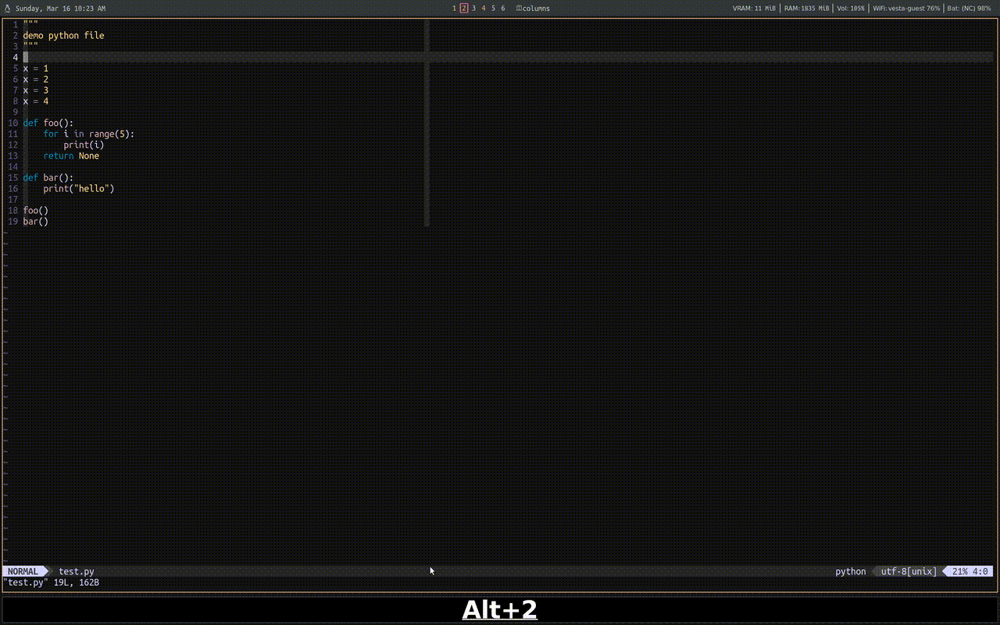

## iron.vim


## How to install
To install, you may doing the following
```bash
mkdir -p ~/.vim/pack/nickeisenberg/start
cd ~/.vim/pack/nickeisenberg/start
git clone https://github.com/nickeisenberg/iron.vim.git
```

If you prefer to use a package manager, such as vim plug, you may do the
following instead
```vimscript
  Plug 'nickeisenberg/iron.vim'
```

## How to configure
### `g:iron_repl_def`
Iron allows you to define custom repl definitions, while defaults for this
option are set in `./ftplugin/<filetype>/iron.vim`. These are commands that are
sent to the terminal, which open up the REPL. For example, 

```vimscript
let g:iron_repl_def = {
 \ "python": "ipython --no--autoindent",
 \ "sh": "zsh --login"
\ }
```

A list can also be passed as a `iron_repl_def` if you want a series of commands
to be ran before opening the REPL. For example,

```vimscript
" This is the default `python` `iron_repl_def`. 
" See 'iron.vim/ftplugin/sh/iron.vim'

if !empty($VIRTUAL_ENV)
  let python_def = [
  	  \ "source $VIRTUAL_ENV/bin/activate",
  	  \ "python3",
  	\ ]
else
  let python_def = "python3"
endif
```

The above checks if a virtual enviornment is activated, and if it is then
`source $VIRTUAL_ENV/bin/activate` will be sent to the REPL followed by
`python3`.

### `g:iron_repl_open_cmd`
Iron provides a function, `iron#view#split`, that allows you to define the
split that opens the repl. The first argument is the split command, ie
`rightbelow`, `botright`, `vert botright`, etc. The second argument is the
percent of the size of the current buffer to be used at the size of the split.

```vimscript
let g:iron_repl_open_cmd = {
  \ 'vertical': iron#view#split('vertical rightbelow', 0.4),
  \ 'horizontal': iron#view#split('rightbelow', 0.25),
  \ '<name>': iron#view#split('<split_cmd>', <size>),
\}
```

If only one `iron_repl_open_cmd` is given, then this command will be accessible
with the `toggle_repl` key map listed below. If more than one
`iron_repl_open_cmd` is given, then each will be accessible in `iron_keymaps`
with the name `toggle_<repl_open_cmd_name>` (See below).

If this option is not set in your `.vimrc`, then the following will be set
```vimscript
let g:iron_repl_open_cmd = {
  \ 'vertical': iron#view#split('vertical rightbelow', 0.4),
  \ }
```

### `g:iron_keymaps`
Iron will not set keymaps by default and they will need to 
provides a set of default named operations that can have key maps assigned
to.

```vimscript
let g:iron_keymaps = {
  \ "toggle_repl": "<leader>rr",
  \ "toggle_vertical": "<leader>rv",  " first `iron_repl_open_cmd`
  \ "toggle_horizontal": "<leader>rh",   " second `iron_repl_open_cmd`
  \ "toggle_<name>": "<leader>r1",  " third `iron_repl_open_cmd`
  \ "repl_restart": "<leader>rR",
  \ "repl_kill": "<leader>rk",
  \ "send_line": "<leader>sl",
  \ "send_visual": "<leader>sp",
  \ "send_paragraph": "<leader>sp",
  \ "send_until_cursor": "<leader>su",
  \ "send_file": "<leader>sf",
  \ "send_cancel": "<leader>sc",
  \ "send_blank_line": "<leader>s<CR>",
\ }
```

### `g:iron_term_wait`
Iron sends text to the REPL line by line. For whatever reason, sometimes the 
REPL lags a little and causes issues in a non-repoducible fashion. This 
variable will force the repl to wait `n` milliseconds to give it some time
to process the line by using `vim`'s built in `term_wait`. I have found that
1 millisecond is enough for `linux` and 5 milliseconds for `macos`.

```vimscript
if system("uname") == "Darwin\n"
  let g:iron_term_wait = 5  " wait time in milliseconds (default is 0)
elseif system("uname") == "Linux\n"
  let g:iron_term_wait = 1  " wait time in milliseconds (default is 0)
endif
```

### `g:iron_repl_debug_log`
If you find yourself doing some debugging and you are curious what is being
sent to the REPL, you can set `g:iron_repl_debug_log = 1`. This will produce a
log file at `~/.local/log/iron_<filetype>.log` and each time you send text to
the REPL, this same text will be appened to the end of the log file.
